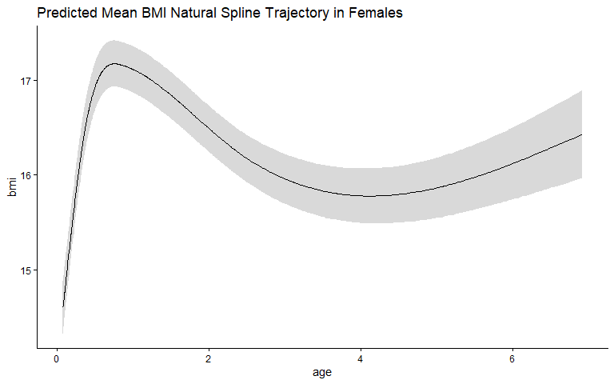
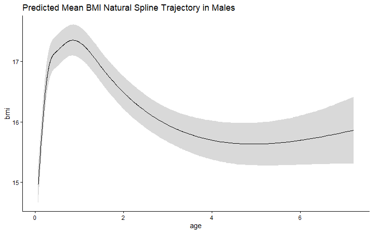
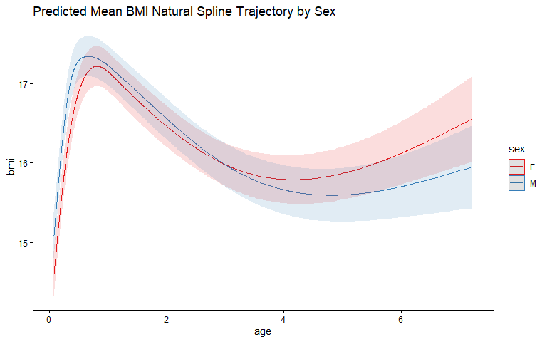
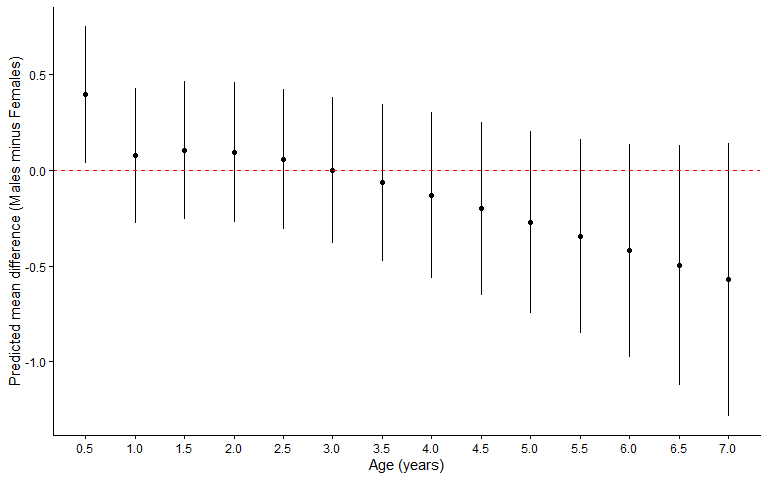

Natural spline LME model in lme4
================
Ahmed Elhakeem
2026-04-21

- [Clear the Work Environment](#clear-the-work-environment)
- [Install Packages (if needed)](#install-packages-if-needed)
- [Load Packages](#load-packages)
- [Load BMI Data Set](#load-bmi-data-set)
  - [Quick Look at the Data](#quick-look-at-the-data)
  - [Create Sex-Stratified Datasets](#create-sex-stratified-datasets)
- [1 – Natural Spline LME: Females](#1--natural-spline-lme-females)
  - [Knot Positions](#knot-positions)
  - [Predicted Mean BMI Trajectory –
    Females](#predicted-mean-bmi-trajectory--females)
- [2 – Natural Spline LME: Males](#2--natural-spline-lme-males)
  - [Knot Positions](#knot-positions-1)
  - [Predicted Mean BMI Trajectory –
    Males](#predicted-mean-bmi-trajectory--males)
- [3 – Natural Spline LME: Males and
  Females](#3--natural-spline-lme-males-and-females)
  - [Knot Positions](#knot-positions-2)
  - [Predicted Mean BMI Trajectory by
    Sex](#predicted-mean-bmi-trajectory-by-sex)
  - [Mean Difference in Predicted BMI (Males minus Females) by
    Age](#mean-difference-in-predicted-bmi-males-minus-females-by-age)

## Clear the Work Environment

``` r
rm(list = ls())
```

## Install Packages (if needed)

``` r
install.packages(c("broom.mixed", "tidyverse", "lme4", "ggeffects",
                   "splines", "marginaleffects", "emmeans", "mgcv"))
```

## Load Packages

``` r
library(broom.mixed)
library(marginaleffects)
library(tidyverse)
library(ggeffects)
library(emmeans)
library(splines)
library(lme4)
```

## Load BMI Data Set

``` r
dat <- read.csv(
  "https://raw.githubusercontent.com/aelhak/ARMSC23/main/bmi_long.csv"
) %>%
  mutate(id = as.factor(id), sex = as.factor(sex))
```

### Quick Look at the Data

``` r
with(dat, plot(age, bmi))
```

<!-- -->

``` r
dat %>% group_by(sex) %>% summarise(N = n_distinct(id))
```

    ## # A tibble: 2 × 2
    ##   sex       N
    ##   <fct> <int>
    ## 1 F       100
    ## 2 M       100

``` r
dat %>%
  group_by(id) %>%
  count() %>%
  ungroup() %>%
  summarise(median(n), min(n), max(n))
```

    ## # A tibble: 1 × 3
    ##   `median(n)` `min(n)` `max(n)`
    ##         <dbl>    <int>    <int>
    ## 1          11        1       21

### Create Sex-Stratified Datasets

``` r
dat_m <- dat %>% filter(sex == "M")
dat_f <- dat %>% filter(sex == "F")
```

------------------------------------------------------------------------

## 1 – Natural Spline LME: Females

Fit natural spline mixed effects models with 3–6 degrees of freedom and
select the best model using BIC.

``` r
ns_f <- map(3:6, possibly(~ {
  eval(parse(text = paste0(
    "lmer(bmi ~ ns(age, ", .x, ") + (age | id),
    REML = F, data = dat_f)"
  )))
}, otherwise = NA_real_))

(ns_f_best <- ns_f[[which.min(unlist(map(ns_f, BIC)))]])
```

    ## Linear mixed model fit by maximum likelihood  ['lmerMod']
    ## Formula: bmi ~ ns(age, 4) + (age | id)
    ##    Data: dat_f
    ##       AIC       BIC    logLik -2*log(L)  df.resid 
    ##  2582.652  2627.192 -1282.326  2564.652      1033 
    ## Random effects:
    ##  Groups   Name        Std.Dev. Corr 
    ##  id       (Intercept) 1.2190        
    ##           age         0.2742   -0.35
    ##  Residual             0.6523        
    ## Number of obs: 1042, groups:  id, 100
    ## Fixed Effects:
    ## (Intercept)  ns(age, 4)1  ns(age, 4)2  ns(age, 4)3  ns(age, 4)4  
    ##     14.6063       2.5982      -0.3776       3.4593       0.5901

### Knot Positions

``` r
attr(terms(ns_f_best), "predvars")
```

    ## list(bmi, ns(age, knots = c(0.351519158, 0.838830521, 2.24447183625
    ## ), Boundary.knots = c(0.076364751, 6.916836223), intercept = FALSE))

### Predicted Mean BMI Trajectory – Females

``` r
predict_response(ns_f_best,
                 terms  = c("age [all]"),
                 margin = "marginalmeans") %>%
  plot() +
  ggtitle("Predicted Mean BMI Natural Spline Trajectory in Females") +
  theme_classic()
```

<!-- -->

------------------------------------------------------------------------

## 2 – Natural Spline LME: Males

Fit natural spline mixed effects models with 3–6 degrees of freedom and
select the best model using BIC.

``` r
ns_m <- map(3:6, possibly(~ {
  eval(parse(text = paste0(
    "lmer(bmi ~ ns(age, ", .x, ") + (age | id),
    REML = F, data = dat_m)"
  )))
}, otherwise = NA_real_))

(ns_m_best <- ns_m[[which.min(unlist(map(ns_m, BIC)))]])
```

    ## Linear mixed model fit by maximum likelihood  ['lmerMod']
    ## Formula: bmi ~ ns(age, 6) + (age | id)
    ##    Data: dat_m
    ##       AIC       BIC    logLik -2*log(L)  df.resid 
    ##  2672.910  2727.453 -1325.455  2650.910      1041 
    ## Random effects:
    ##  Groups   Name        Std.Dev. Corr 
    ##  id       (Intercept) 1.2521        
    ##           age         0.2954   -0.32
    ##  Residual             0.6689        
    ## Number of obs: 1052, groups:  id, 100
    ## Fixed Effects:
    ## (Intercept)  ns(age, 6)1  ns(age, 6)2  ns(age, 6)3  ns(age, 6)4  ns(age, 6)5  
    ##     14.9672       2.1894       2.5570       1.4127      -0.2691       2.4643  
    ## ns(age, 6)6  
    ##     -0.1753

### Knot Positions

``` r
attr(terms(ns_m_best), "predvars")
```

    ## list(bmi, ns(age, knots = c(0.2545100625, 0.468764600333333, 
    ## 0.78427165, 1.49894777866667, 3.50837651933333), Boundary.knots = c(0.07630629, 
    ## 7.208082142), intercept = FALSE))

### Predicted Mean BMI Trajectory – Males

``` r
predict_response(ns_m_best,
                 terms  = c("age [all]"),
                 margin = "marginalmeans") %>%
  plot() +
  ggtitle("Predicted Mean BMI Natural Spline Trajectory in Males") +
  theme_classic()
```

<!-- -->

------------------------------------------------------------------------

## 3 – Natural Spline LME: Males and Females

Fit models with 3–6 df including interactions between age and sex, and
select the model with the lowest BIC.

``` r
ns_mf <- map(3:6, possibly(~ {
  eval(parse(text = paste0(
    "lmer(bmi ~ ns(age, ", .x, ") * sex + (age | id),
    REML = F, data = dat)"
  )))
}, otherwise = NA_real_))

(ns_mf_best <- ns_mf[[which.min(unlist(map(ns_mf, BIC)))]])
```

    ## Linear mixed model fit by maximum likelihood  ['lmerMod']
    ## Formula: bmi ~ ns(age, 5) * sex + (age | id)
    ##    Data: dat
    ##       AIC       BIC    logLik -2*log(L)  df.resid 
    ##  5261.728  5352.078 -2614.864  5229.728      2078 
    ## Random effects:
    ##  Groups   Name        Std.Dev. Corr 
    ##  id       (Intercept) 1.2348        
    ##           age         0.2846   -0.33
    ##  Residual             0.6632        
    ## Number of obs: 2094, groups:  id, 200
    ## Fixed Effects:
    ##      (Intercept)       ns(age, 5)1       ns(age, 5)2       ns(age, 5)3  
    ##         14.59730           2.81813           2.08979           0.05257  
    ##      ns(age, 5)4       ns(age, 5)5              sexM  ns(age, 5)1:sexM  
    ##          2.98414           1.03194           0.48497          -0.45665  
    ## ns(age, 5)2:sexM  ns(age, 5)3:sexM  ns(age, 5)4:sexM  ns(age, 5)5:sexM  
    ##         -0.32209          -0.66083          -0.65169          -1.22333

### Knot Positions

``` r
attr(terms(ns_mf_best), "predvars")
```

    ## list(bmi, ns(age, knots = c(0.2833373708, 0.5807503106, 1.126253912, 
    ## 3.0883893664), Boundary.knots = c(0.07630629, 7.208082142), intercept = FALSE), 
    ##     sex)

### Predicted Mean BMI Trajectory by Sex

``` r
predict_response(ns_mf_best,
                 terms  = c("age [all]", "sex [all]"),
                 margin = "marginalmeans") %>%
  plot() +
  ggtitle("Predicted Mean BMI Natural Spline Trajectory by Sex") +
  theme_classic()
```

<!-- -->

### Mean Difference in Predicted BMI (Males minus Females) by Age

``` r
pred_diff <- comparisons(
  ns_mf_best,
  variables = "sex",
  newdata   = datagrid(age = seq(0.5, 7, by = 0.5))
) %>% as.data.frame()

ggplot(data = pred_diff,
       aes(x = age, y = estimate, ymin = conf.low, ymax = conf.high)) +
  theme_classic() +
  geom_pointrange(size = 0.25) +
  geom_hline(yintercept = 0, lty = 2, col = "red", linewidth = 0.1) +
  scale_x_continuous(breaks = seq(0.5, 7, by = 0.5)) +
  xlab("Age (years)") +
  ylab("Predicted mean difference (Males minus Females)")
```

<!-- -->
