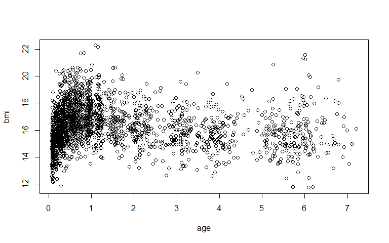
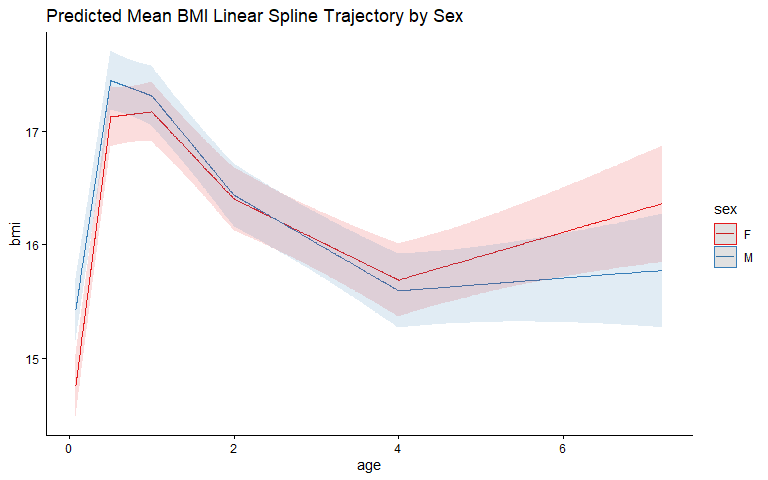
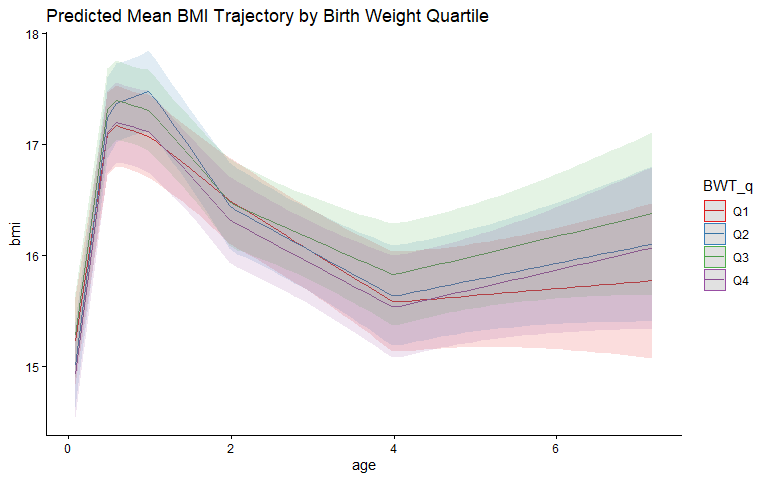

Linear splines offer a transparent way to model trajectories that change
rate across distinct time periods. Unlike natural cubic splines, which
fit smooth piecewise cubic curves, a linear spline joins straight-line
segments at a set of user-specified **knot** positions. The slope of
each segment is directly interpretable as the mean rate of change in the
outcome per unit time during that interval. By placing knots at
biologically meaningful ages, the researcher can capture known periods
of rapid change while keeping the fixed-effects coefficients easy to
communicate.

In this tutorial we use the `lspline()` function from the `lspline`
package to build linear spline linear mixed effects (LME) models of BMI
from infancy to early school age. We work through two analyses: a model
with a sex-by-age interaction to characterise differences in the BMI
trajectory between females and males, and a model that additionally
includes a birth-weight-group-by-age interaction to estimate differences
in the BMI trajectory between birth weight groups.

**Dataset:** Longitudinal BMI measurements on 200 children (100 female,
100 male), each with a median of 11 repeated measurements (range: 1–21)
over roughly the first 7 years of life, available from the
[LongitudinalModelling fake datasets
repository](https://github.com/LongitudinalModelling/fake_datasets).

Note the data are simulated and used for demonstration purposes only.

------------------------------------------------------------------------

## Setup

### Clear the Work Environment

``` r
rm(list = ls())
```

It is good practice to start with a clean environment to avoid any
objects from a previous session interfering with the analysis.

### Install Packages (if needed)

``` r
install.packages(c(
  "broom.mixed", "tidyverse", "lme4", "lmerTest", "lspline",
  "ggeffects", "marginaleffects", "emmeans"
))
```

### Load Packages

``` r
library(broom.mixed)        # tidy model summaries for mixed effects models
library(marginaleffects)    # marginal means, contrasts, and comparisons
library(lspline)            # lspline() for linear spline basis functions
library(tidyverse)          # data manipulation and plotting
library(ggeffects)          # predicted values and plots from models
library(emmeans)            # estimated marginal means
library(lme4)               # linear mixed effects models
library(lmerTest)           # p-values for linear mixed effects models
```

------------------------------------------------------------------------

## Load and Explore the Data

``` r
dat <- read.csv(
  "https://raw.githubusercontent.com/LongitudinalModelling/fake_datasets/main/abcd_bmi_long.csv"
) %>%
  mutate(id = as.factor(id), sex = as.factor(sex))

head(dat)
```

    ##     id sex        age      bmi
    ## 1 F001   F 0.08913299 13.03518
    ## 2 F001   F 0.16633171 13.47940
    ## 3 F001   F 0.24662362 15.10929
    ## 4 F001   F 0.31606659 14.72053
    ## 5 F001   F 0.41350706 15.91750
    ## 6 F001   F 0.53115584 14.66813

The dataset is read directly from GitHub.

### Quick Look at the Data

``` r
with(dat, plot(age, bmi))
```

<!-- -->

``` r
dat %>% group_by(sex) %>% summarise(N = n_distinct(id))
```

    ## # A tibble: 2 × 2
    ##   sex       N
    ##   <fct> <int>
    ## 1 F       100
    ## 2 M       100

``` r
dat %>%
  group_by(id) %>%
  count() %>%
  ungroup() %>%
  summarise(median(n), min(n), max(n))
```

    ## # A tibble: 1 × 3
    ##   `median(n)` `min(n)` `max(n)`
    ##         <dbl>    <int>    <int>
    ## 1          11        1       21

``` r
summary(dat$age)
```

    ##    Min. 1st Qu.  Median    Mean 3rd Qu.    Max. 
    ## 0.07631 0.35075 0.79967 1.61011 2.24256 7.20808

The scatter plot shows all observed BMI measurements plotted against
age. The dataset contains 100 females and 100 males, each with a median
of 11 repeated measurements (range: 1–21). Age ranges from roughly 1
month to about 7 years.

### Create Birth Weight Groups

This dataset does not record birth weight, so we **simulate** one for
illustration. We draw a single birth weight per child from a normal
distribution (mean 3,500 g, SD 500 g) and split it into quartile groups,
from Q1 (lowest) to Q4 (highest), with Q1 as the reference category.

``` r
set.seed(2024)

bwt_sim <- dat %>%
  distinct(id) %>%
  mutate(BWT = rnorm(n(), mean = 3500, sd = 500))

bwt_breaks <- quantile(bwt_sim$BWT, probs = seq(0, 1, 0.25))

dat <- dat %>%
  left_join(bwt_sim, by = "id") %>%
  mutate(BWT_q = cut(
    BWT,
    breaks = bwt_breaks,
    labels = c("Q1", "Q2", "Q3", "Q4"),
    include.lowest = TRUE
  ))

dat %>% group_by(BWT_q) %>% summarise(N = n_distinct(id)) %>% mutate(`(%)` = prop.table(N)*100)
```

    ## # A tibble: 4 × 3
    ##   BWT_q     N `(%)`
    ##   <fct> <int> <dbl>
    ## 1 Q1       50    25
    ## 2 Q2       50    25
    ## 3 Q3       50    25
    ## 4 Q4       50    25

`set.seed()` makes the simulation reproducible. We generate one birth
weight per child (`distinct(id)`), cut it at its quartiles, and join the
resulting group back onto every row of the long-format data. Because the
simulated birth weight is unrelated to BMI by construction, this
analysis is intended to demonstrate the modelling workflow for a
categorical grouping variable rather than to reveal a real birth-weight
effect — we would expect the four groups to follow essentially the same
trajectory.

------------------------------------------------------------------------

## 1 – Linear Spline LME: Sex Differences in BMI Trajectory

To formally test whether BMI trajectories differ between sexes, we fit a
combined model with an interaction between the linear spline of age and
sex. This allows the rate of BMI change in every age segment to differ
between females and males.

``` r
(ls_mod_mf <- lmer(
  bmi ~ lspline(age, c(0.5, 1, 2, 4)) * sex + (age | id),
  REML = FALSE, data = dat
))
```

    ## Linear mixed model fit by maximum likelihood  ['lmerModLmerTest']
    ## Formula: bmi ~ lspline(age, c(0.5, 1, 2, 4)) * sex + (age | id)
    ##    Data: dat
    ##       AIC       BIC    logLik -2*log(L)  df.resid 
    ##  5323.719  5414.068 -2645.859  5291.719      2078 
    ## Random effects:
    ##  Groups   Name        Std.Dev. Corr  
    ##  id       (Intercept) 1.2336         
    ##           age         0.2827   -0.33 
    ##  Residual             0.6754         
    ## Number of obs: 2094, groups:  id, 200
    ## Fixed Effects:
    ##                         (Intercept)       lspline(age, c(0.5, 1, 2, 4))1  
    ##                            14.32917                              5.59959  
    ##      lspline(age, c(0.5, 1, 2, 4))2       lspline(age, c(0.5, 1, 2, 4))3  
    ##                             0.08847                             -0.76962  
    ##      lspline(age, c(0.5, 1, 2, 4))4       lspline(age, c(0.5, 1, 2, 4))5  
    ##                            -0.35753                              0.21088  
    ##                                sexM  lspline(age, c(0.5, 1, 2, 4))1:sexM  
    ##                             0.73753                             -0.83453  
    ## lspline(age, c(0.5, 1, 2, 4))2:sexM  lspline(age, c(0.5, 1, 2, 4))3:sexM  
    ##                            -0.35888                             -0.10634  
    ## lspline(age, c(0.5, 1, 2, 4))4:sexM  lspline(age, c(0.5, 1, 2, 4))5:sexM  
    ##                            -0.06459                             -0.15441

**What this code does:**

- `lspline(age, c(0.5, 1, 2, 4))` creates a piecewise linear basis with
  four knots at **6 months, 1 year, 2 years, and 4 years**, producing
  five segments. The knots are chosen to roughly coincide with known
  phases of early growth rather than being selected from data by an
  information criterion.
- Each coefficient for `lspline(age, ...)k` is the estimated mean
  **slope** (rate of BMI change in kg/m² per year) within segment k for
  the reference group (females). Unlike natural cubic spline basis
  coefficients, these are directly interpretable as rates of change.
- `lspline(age, ...) * sex` expands to
  `lspline(age, ...) + sex + lspline(age, ...):sex`. The interaction
  terms allow the slope in each segment to differ between females and
  males — not just a constant vertical offset.
- `(age | id)` specifies a random intercept and a random slope for age
  within each child, allowing each child’s trajectory to deviate from
  the population mean in both starting level and rate of change.
- `REML = FALSE` fits by maximum likelihood, required to allow fair
  comparison of models with different fixed effects via information
  criteria.

The four knots define five age segments:

| Segment | Age range         |
|---------|-------------------|
| 1       | 0 – 6 months      |
| 2       | 6 months – 1 year |
| 3       | 1 – 2 years       |
| 4       | 2 – 4 years       |
| 5       | 4 – 7 years       |

**Reading the random effects output:**

- `id (Intercept)` SD: between-person variation in predicted BMI at age
  zero (approximately birth), i.e. how much children differ in their
  starting BMI level.
- `id age` SD: between-person variation in the rate of BMI change over
  time.
- `Corr`: the correlation between a child’s BMI near birth and their
  overall rate of change.
- `Residual` SD: within-person variation not explained by the model.

**Reading the fixed effects output:** Each `lspline(age, ...)k`
coefficient is the estimated mean rate of BMI change (kg/m² per year) in
segment k **for females** (the reference group). The corresponding rate
for males is obtained by adding the `lspline(age, ...)k:sexM`
interaction term. The `sexM` main effect is the sex difference (males vs
females) in predicted BMI at age zero.

> **Interpretation:** To read the random effects, take each SD on the
> BMI scale. The intercept SD of about 1.23 kg/m² describes how widely
> children’s predicted BMI at age zero is spread around the mean —
> roughly two-thirds of children sit within ±1.23 kg/m² of it. The
> age-slope SD of 0.28 kg/m²/year says children also differ in their
> overall rate of change, and the intercept–slope correlation (−0.33)
> tells us that children starting higher tend to have somewhat shallower
> slopes (a description of how the two vary together, not a mechanism).
> The residual SD (0.68) is the variation left within a child once the
> mean curve and their personal intercept and slope are accounted for.
> For the fixed part, read each `lspline(age, …)k` as the average BMI
> change per year for females during that segment: a steep +5.6
> kg/m²/year over the first 6 months, essentially flat from 6–12 months
> (+0.09, around the infant peak), then −0.77 and −0.36 kg/m²/year as
> BMI falls across ages 1–2 and 2–4, and +0.21 over ages 4–7 as the
> curve turns back up. The `sexM` value (+0.74) is read at age zero
> only: males’ predicted BMI starts about 0.74 kg/m² above females’.

### Segment Slopes and Sex Differences

``` r
as.data.frame(tidy(ls_mod_mf, conf.int = TRUE)) %>%
  filter(effect == "fixed") %>%
  select(-group)
```

    ##    effect                                term    estimate  std.error  statistic
    ## 1   fixed                         (Intercept) 14.32916912 0.14768584 97.0246677
    ## 2   fixed      lspline(age, c(0.5, 1, 2, 4))1  5.59958982 0.22504111 24.8825200
    ## 3   fixed      lspline(age, c(0.5, 1, 2, 4))2  0.08846835 0.18519820  0.4776955
    ## 4   fixed      lspline(age, c(0.5, 1, 2, 4))3 -0.76961881 0.11154844 -6.8994133
    ## 5   fixed      lspline(age, c(0.5, 1, 2, 4))4 -0.35752819 0.07249555 -4.9317256
    ## 6   fixed      lspline(age, c(0.5, 1, 2, 4))5  0.21088033 0.07186186  2.9345238
    ## 7   fixed                                sexM  0.73752619 0.20870915  3.5337512
    ## 8   fixed lspline(age, c(0.5, 1, 2, 4))1:sexM -0.83452584 0.31547010 -2.6453405
    ## 9   fixed lspline(age, c(0.5, 1, 2, 4))2:sexM -0.35888435 0.26212846 -1.3691163
    ## 10  fixed lspline(age, c(0.5, 1, 2, 4))3:sexM -0.10634281 0.15913871 -0.6682398
    ## 11  fixed lspline(age, c(0.5, 1, 2, 4))4:sexM -0.06459304 0.10280242 -0.6283221
    ## 12  fixed lspline(age, c(0.5, 1, 2, 4))5:sexM -0.15440789 0.09927242 -1.5553957
    ##           df       p.value    conf.low   conf.high
    ## 1   296.9669 6.124851e-227 14.03852570 14.61981255
    ## 2  1773.1461 1.799042e-117  5.15821607  6.04096356
    ## 3  1812.1484  6.329245e-01 -0.27475605  0.45169275
    ## 4  1902.9213  7.084416e-12 -0.98838888 -0.55084873
    ## 5  1489.7667  9.063628e-07 -0.49973239 -0.21532398
    ## 6  1425.9985  3.394045e-03  0.06991403  0.35184663
    ## 7   298.2765  4.746633e-04  0.32679723  1.14825516
    ## 8  1775.8121  8.232853e-03 -1.45325759 -0.21579409
    ## 9  1813.4364  1.711325e-01 -0.87298983  0.15522113
    ## 10 1905.1684  5.040615e-01 -0.41844722  0.20576160
    ## 11 1482.5926  5.298897e-01 -0.26624670  0.13706063
    ## 12 1360.3233  1.200845e-01 -0.34915152  0.04033575

The table shows, for each segment: the estimated slope for females, the
sex difference in slope (the interaction term), and 95% confidence
intervals and p-values for each. To read the males’ slope in a given
segment, sum the females’ slope coefficient and the corresponding
interaction coefficient.

> **Interpretation:** Each interaction row is the male slope minus the
> female slope in that segment, so a male slope is the female slope plus
> the interaction. The clearest contrast is the first segment: females
> rise at +5.6 kg/m²/year over 0–6 months while males rise at 5.6 − 0.83
> ≈ 4.8, and that −0.83 difference has a confidence interval (−1.45 to
> −0.22) lying entirely below zero, so the data point fairly
> consistently to a steeper early rise in females. For segments 2–5 the
> interaction intervals all span zero (for example −0.87 to 0.16 at 6–12
> months), meaning the data are about equally compatible with the two
> sexes sharing those slopes.

### P-value for Sex Interaction Term

``` r
anova(ls_mod_mf)[3, ]
```

    ## Type III Analysis of Variance Table with Satterthwaite's method
    ##                                   Sum Sq Mean Sq NumDF  DenDF F value    Pr(>F)
    ## lspline(age, c(0.5, 1, 2, 4)):sex 11.829  2.3657     5 1105.6  5.1859 0.0001036
    ##                                      
    ## lspline(age, c(0.5, 1, 2, 4)):sex ***
    ## ---
    ## Signif. codes:  0 '***' 0.001 '**' 0.01 '*' 0.05 '.' 0.1 ' ' 1

> **Interpretation:** This single test asks whether the five segment
> slopes, taken together, are the same for both sexes. With F(5, 1105.6)
> = 5.19 and p ≈ 0.0001, the data are not very compatible with one
> shared trajectory — there is clear evidence that the rate of BMI
> change differs between females and males somewhere across the age
> range. Being an omnibus test, it does not say where; reading it
> together with the per-segment table and the plot points to the first 6
> months as the main contributor.

### Predicted Mean BMI Trajectory by Sex

``` r
predict_response(ls_mod_mf,
                 terms  = c("age [all]", "sex [all]"),
                 margin = "marginalmeans") %>%
  plot() +
  ggtitle("Predicted Mean BMI Linear Spline Trajectory by Sex") +
  theme_classic()
```

<!-- -->

Plotting both sexes on the same axes allows direct visual comparison of
the piecewise linear trajectories. The shaded bands are 95% confidence
intervals for each sex-specific mean. The characteristic kinks at the
knot positions (6 m, 1 yr, 2 yr, 4 yr) are visible as changes in slope
direction.

> **Interpretation:** Read the two lines as the average trajectory for
> each sex, with the shaded bands showing how precisely each mean is
> pinned down. Males begin a little higher (matching the +0.74 `sexM`
> term), but the steeper female rise over the first months means the
> lines come together by the peak around 6–12 months; both then fall to
> a low point near age 4 and turn upward. After infancy the bands
> overlap heavily, so although the female mean sits marginally above the
> male mean in the preschool years, that separation is small relative to
> the uncertainty. The pattern to take away is that the sexes are most
> clearly distinguished where the curves are both far apart and tightly
> estimated — early infancy — and are hard to tell apart elsewhere.

------------------------------------------------------------------------

## 2 – Linear Spline LME: Effect of Birth Weight on BMI Trajectory

We extend the model to include an interaction between the linear spline
of age and the (simulated) birth weight quartile group (`BWT_q`). This
allows the rate of BMI change in each segment to differ across the four
birth weight groups, while still adjusting for sex.

``` r
(ls_mod_bw_mf <- lmer(
  bmi ~ lspline(age, c(0.5, 1, 2, 4)) * (sex + BWT_q) + (age | id),
  REML = FALSE, data = dat
))
```

    ## Linear mixed model fit by maximum likelihood  ['lmerModLmerTest']
    ## Formula: bmi ~ lspline(age, c(0.5, 1, 2, 4)) * (sex + BWT_q) + (age |      id)
    ##    Data: dat
    ##       AIC       BIC    logLik -2*log(L)  df.resid 
    ##  5338.242  5530.234 -2635.121  5270.242      2060 
    ## Random effects:
    ##  Groups   Name        Std.Dev. Corr  
    ##  id       (Intercept) 1.2302         
    ##           age         0.2818   -0.33 
    ##  Residual             0.6717         
    ## Number of obs: 2094, groups:  id, 200
    ## Fixed Effects:
    ##                            (Intercept)          lspline(age, c(0.5, 1, 2, 4))1  
    ##                              14.470180                                5.098290  
    ##         lspline(age, c(0.5, 1, 2, 4))2          lspline(age, c(0.5, 1, 2, 4))3  
    ##                              -0.043972                               -0.540831  
    ##         lspline(age, c(0.5, 1, 2, 4))4          lspline(age, c(0.5, 1, 2, 4))5  
    ##                              -0.417388                                0.131800  
    ##                                   sexM                                 BWT_qQ2  
    ##                               0.768420                               -0.285912  
    ##                                BWT_qQ3                                 BWT_qQ4  
    ##                               0.021307                               -0.357092  
    ##    lspline(age, c(0.5, 1, 2, 4))1:sexM     lspline(age, c(0.5, 1, 2, 4))2:sexM  
    ##                              -0.874993                               -0.376623  
    ##    lspline(age, c(0.5, 1, 2, 4))3:sexM     lspline(age, c(0.5, 1, 2, 4))4:sexM  
    ##                              -0.091688                               -0.068966  
    ##    lspline(age, c(0.5, 1, 2, 4))5:sexM  lspline(age, c(0.5, 1, 2, 4))1:BWT_qQ2  
    ##                              -0.141956                                0.901125  
    ## lspline(age, c(0.5, 1, 2, 4))2:BWT_qQ2  lspline(age, c(0.5, 1, 2, 4))3:BWT_qQ2  
    ##                               0.495044                               -0.464847  
    ## lspline(age, c(0.5, 1, 2, 4))4:BWT_qQ2  lspline(age, c(0.5, 1, 2, 4))5:BWT_qQ2  
    ##                               0.052730                                0.087096  
    ## lspline(age, c(0.5, 1, 2, 4))1:BWT_qQ3  lspline(age, c(0.5, 1, 2, 4))2:BWT_qQ3  
    ##                               0.418396                                0.002343  
    ## lspline(age, c(0.5, 1, 2, 4))3:BWT_qQ3  lspline(age, c(0.5, 1, 2, 4))4:BWT_qQ3  
    ##                              -0.248587                                0.130486  
    ## lspline(age, c(0.5, 1, 2, 4))5:BWT_qQ3  lspline(age, c(0.5, 1, 2, 4))1:BWT_qQ4  
    ##                               0.112867                                0.771588  
    ## lspline(age, c(0.5, 1, 2, 4))2:BWT_qQ4  lspline(age, c(0.5, 1, 2, 4))3:BWT_qQ4  
    ##                               0.024136                               -0.214242  
    ## lspline(age, c(0.5, 1, 2, 4))4:BWT_qQ4  lspline(age, c(0.5, 1, 2, 4))5:BWT_qQ4  
    ##                               0.063050                                0.107385

Writing the spline once and interacting it with `(sex + BWT_q)` is
equivalent to interacting it with each separately, but keeps a single
`lspline(age, ...)` basis in the model. The specification adds main
effects for groups Q2, Q3 and Q4 (each relative to the Q1 reference
group) plus five segment-specific interaction terms for each of these
groups. Each `lspline(age, ...)k:BWT_qQ#` coefficient is the difference
in the segment-k slope (kg/m²/year) for that birth weight group relative
to Q1, after adjusting for sex.

### Segment Slopes and Birth Weight Effects

``` r
as.data.frame(tidy(ls_mod_bw_mf, conf.int = TRUE)) %>%
  filter(effect == "fixed") %>%
  select(-group)
```

    ##    effect                                   term     estimate std.error
    ## 1   fixed                            (Intercept) 14.470179988 0.2332748
    ## 2   fixed         lspline(age, c(0.5, 1, 2, 4))1  5.098290267 0.3544648
    ## 3   fixed         lspline(age, c(0.5, 1, 2, 4))2 -0.043971685 0.2966400
    ## 4   fixed         lspline(age, c(0.5, 1, 2, 4))3 -0.540830761 0.1732624
    ## 5   fixed         lspline(age, c(0.5, 1, 2, 4))4 -0.417388393 0.1105299
    ## 6   fixed         lspline(age, c(0.5, 1, 2, 4))5  0.131800077 0.1114171
    ## 7   fixed                                   sexM  0.768420198 0.2088771
    ## 8   fixed                                BWT_qQ2 -0.285912043 0.2956469
    ## 9   fixed                                BWT_qQ3  0.021307398 0.2953859
    ## 10  fixed                                BWT_qQ4 -0.357091556 0.2973623
    ## 11  fixed    lspline(age, c(0.5, 1, 2, 4))1:sexM -0.874993101 0.3148485
    ## 12  fixed    lspline(age, c(0.5, 1, 2, 4))2:sexM -0.376622636 0.2615791
    ## 13  fixed    lspline(age, c(0.5, 1, 2, 4))3:sexM -0.091688101 0.1593972
    ## 14  fixed    lspline(age, c(0.5, 1, 2, 4))4:sexM -0.068965694 0.1034807
    ## 15  fixed    lspline(age, c(0.5, 1, 2, 4))5:sexM -0.141955983 0.1003825
    ## 16  fixed lspline(age, c(0.5, 1, 2, 4))1:BWT_qQ2  0.901125226 0.4429850
    ## 17  fixed lspline(age, c(0.5, 1, 2, 4))2:BWT_qQ2  0.495044353 0.3660159
    ## 18  fixed lspline(age, c(0.5, 1, 2, 4))3:BWT_qQ2 -0.464846878 0.2222439
    ## 19  fixed lspline(age, c(0.5, 1, 2, 4))4:BWT_qQ2  0.052729687 0.1437494
    ## 20  fixed lspline(age, c(0.5, 1, 2, 4))5:BWT_qQ2  0.087096071 0.1355329
    ## 21  fixed lspline(age, c(0.5, 1, 2, 4))1:BWT_qQ3  0.418396299 0.4455969
    ## 22  fixed lspline(age, c(0.5, 1, 2, 4))2:BWT_qQ3  0.002343189 0.3725840
    ## 23  fixed lspline(age, c(0.5, 1, 2, 4))3:BWT_qQ3 -0.248586783 0.2264198
    ## 24  fixed lspline(age, c(0.5, 1, 2, 4))4:BWT_qQ3  0.130485813 0.1443422
    ## 25  fixed lspline(age, c(0.5, 1, 2, 4))5:BWT_qQ3  0.112867069 0.1417430
    ## 26  fixed lspline(age, c(0.5, 1, 2, 4))1:BWT_qQ4  0.771587771 0.4507721
    ## 27  fixed lspline(age, c(0.5, 1, 2, 4))2:BWT_qQ4  0.024136028 0.3772399
    ## 28  fixed lspline(age, c(0.5, 1, 2, 4))3:BWT_qQ4 -0.214241774 0.2238242
    ## 29  fixed lspline(age, c(0.5, 1, 2, 4))4:BWT_qQ4  0.063049731 0.1431921
    ## 30  fixed lspline(age, c(0.5, 1, 2, 4))5:BWT_qQ4  0.107384997 0.1379009
    ##       statistic        df       p.value    conf.low   conf.high
    ## 1  62.030615171  298.5019 1.346293e-172 14.01110845 14.92925152
    ## 2  14.383063006 1770.8409  1.905892e-44  4.40307676  5.79350378
    ## 3  -0.148232490 1814.5611  8.821758e-01 -0.62576346  0.53782009
    ## 4  -3.121454572 1907.5438  1.826575e-03 -0.88063446 -0.20102706
    ## 5  -3.776250099 1380.0939  1.659715e-04 -0.63421309 -0.20056369
    ## 6   1.182943146 1434.8099  2.370277e-01 -0.08675776  0.35035792
    ## 7   3.678814564  297.0178  2.781291e-04  0.35735356  1.17948683
    ## 8  -0.967072671  297.7514  3.342925e-01 -0.86773428  0.29591019
    ## 9   0.072134103  297.0521  9.425437e-01 -0.56000680  0.60262160
    ## 10 -1.200863573  295.9138  2.307645e-01 -0.94230446  0.22812134
    ## 11 -2.779092207 1776.0475  5.508514e-03 -1.49250571 -0.25748049
    ## 12 -1.439804190 1813.3467  1.500954e-01 -0.88965062  0.13640534
    ## 13 -0.575217753 1904.5348  5.652120e-01 -0.40429955  0.22092335
    ## 14 -0.666459787 1490.9948  5.052204e-01 -0.27194882  0.13401743
    ## 15 -1.414150821 1371.9361  1.575445e-01 -0.33887578  0.05496381
    ## 16  2.034211770 1772.7869  4.207884e-02  0.03229747  1.76995298
    ## 17  1.352521409 1813.0122  1.763772e-01 -0.22281288  1.21290159
    ## 18 -2.091606852 1903.3448  3.660595e-02 -0.90071410 -0.02897965
    ## 19  0.366816731 1461.2152  7.138088e-01 -0.22924754  0.33470691
    ## 20  0.642619505 1327.5869  5.205820e-01 -0.17878589  0.35297803
    ## 21  0.938956918 1773.6539  3.478807e-01 -0.45555398  1.29234658
    ## 22  0.006289021 1810.8040  9.949828e-01 -0.72839655  0.73308293
    ## 23 -1.097902167 1903.9565  2.723860e-01 -0.69264371  0.19547015
    ## 24  0.904003451 1473.8716  3.661413e-01 -0.15265214  0.41362377
    ## 25  0.796279446 1350.6646  4.260096e-01 -0.16519336  0.39092749
    ## 26  1.711702593 1776.1977  8.712606e-02 -0.11251176  1.65568730
    ## 27  0.063980583 1815.3110  9.489927e-01 -0.71573387  0.76400593
    ## 28 -0.957187500 1909.4761  3.385938e-01 -0.65320749  0.22472394
    ## 29  0.440315617 1438.5069  6.597747e-01 -0.21783802  0.34393748
    ## 30  0.778711470 1356.6061  4.362855e-01 -0.16313712  0.37790711

The `lspline(age, ...)k:BWT_qQ#` rows show, for each segment, how that
group’s slope differs from the Q1 reference group. A positive value
means the group gains BMI faster (or declines more slowly) than Q1 in
that segment; a negative value means a slower gain (or faster decline).
The `BWT_qQ#` main effects give each group’s sex-adjusted difference in
predicted BMI at age zero relative to Q1.

> **Interpretation:** Read each `…:BWT_qQ#` row as how that quartile’s
> segment slope compares with Q1, and each `BWT_qQ#` main effect as its
> starting (age-zero) difference from Q1. Almost all of these are small
> with confidence intervals that include zero, so the table gives little
> indication that the groups follow different trajectories. A couple of
> individual coefficients have intervals that happen to exclude zero
> (for example the 0–6 month slope for Q2, +0.90, and the 1–2 year slope
> for Q2, −0.46), but with 15 interaction terms on view some will fall
> outside zero by chance alone — which is exactly why the joint test
> below and the plot are more trustworthy than scanning single rows.
> Since birth weight here was simulated independently of BMI, no
> systematic pattern is expected.

### P-value for Birth Weight Interaction Term

``` r
anova(ls_mod_bw_mf)[5, ]
```

    ## Type III Analysis of Variance Table with Satterthwaite's method
    ##                                     Sum Sq Mean Sq NumDF DenDF F value Pr(>F)
    ## lspline(age, c(0.5, 1, 2, 4)):BWT_q 9.2107 0.61404    15  1102  1.3609  0.159

The F-test for `lspline(age, ...):BWT_q` is an omnibus test of whether
birth weight modifies the shape of the BMI trajectory — i.e. whether the
slope in any of the five segments differs significantly across the four
birth weight groups. A significant result indicates that the association
between birth weight and BMI is not constant across childhood but varies
in magnitude or direction at different ages.

> **Interpretation:** Pooling all 15 group-by-segment terms gives F(15,
> 1102) = 1.36, p ≈ 0.16. A value this size means the observed group
> differences are well within what random variation would produce if
> every quartile shared the same trajectory, so the data are compatible
> with no difference in trajectory shape across birth weight groups.
> This matches both the coefficient table and the way the variable was
> simulated.

### Predicted Mean BMI Trajectory by Birth Weight

``` r
predict_response(ls_mod_bw_mf,
                 terms  = c("age [0.08:7.2 by=0.1]", "BWT_q"),
                 margin = "marginalmeans") %>%
  plot() +
  ggtitle("Predicted Mean BMI Trajectory by Birth Weight Quartile") +
  theme_classic()
```

<!-- -->

Each line is the predicted mean BMI trajectory for one birth weight
group, from Q1 (lowest) to Q4 (highest), with shaded 95% confidence
bands. Periods where the curves run parallel indicate no
birth-weight-by-age interaction in that segment; periods where they
converge, diverge, or cross indicate that the association between birth
weight and BMI changes with age.

> **Interpretation:** The four group trajectories lie almost on top of
> one another, with confidence bands that overlap at every age and no
> consistent ordering from Q1 to Q4. Read this alongside the omnibus
> test: near-parallel, overlapping curves are the visual counterpart of
> an interaction that cannot be distinguished from zero. As expected for
> an independently simulated grouping, birth weight quartile is not
> associated with a different BMI trajectory here.

------------------------------------------------------------------------

## Summary

In this tutorial we fitted linear spline LME models to characterise the
mean BMI trajectory from infancy to early school age. Key points:

- Linear splines join straight-line segments at user-specified knot
  positions. Unlike natural cubic splines, the segment slopes are
  directly interpretable as mean rates of BMI change within each
  interval.
- Knots were placed at biologically meaningful ages (6 m, 1 yr, 2 yr, 4
  yr), defining five segments that correspond to known phases of early
  growth.
- A combined model with a sex-by-spline interaction tests whether
  females and males differ in the shape of their BMI trajectories, not
  just in average BMI level.
- Extending the model to include a birth-weight-group-by-spline
  interaction (simulated groups Q1–Q4, entered as a categorical factor)
  demonstrates how group differences in the BMI trajectory would be
  estimated and tested, while adjusting for sex.
